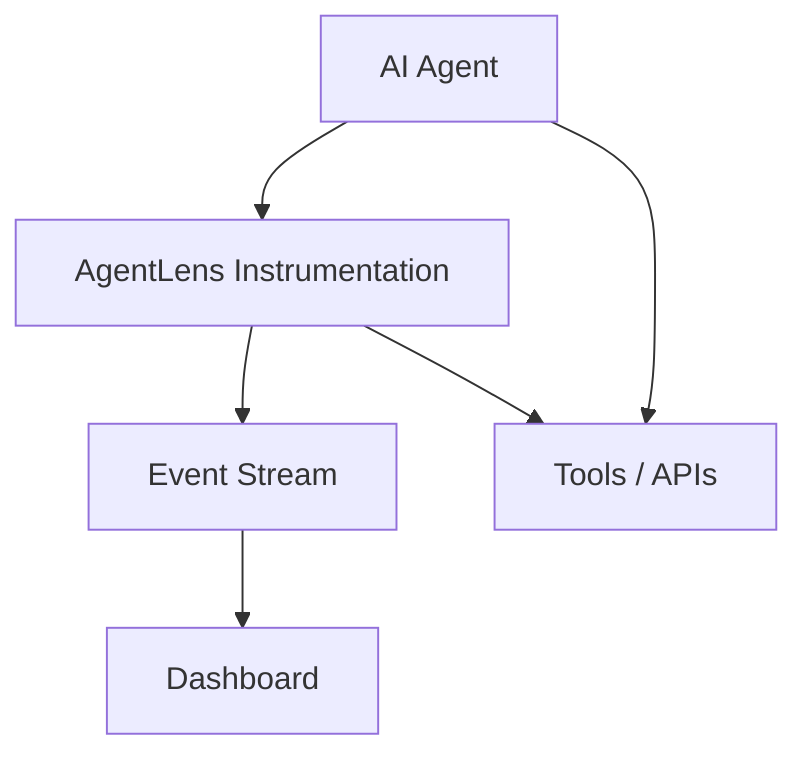

# AgentLens


A real-time observability and debugging layer for AI agents.

Modern agent systems are difficult to debug. Developers often cannot easily see:

• what reasoning steps an agent took  
• which tools were called  
• how state or memory changed  
• why a decision was made  

AgentLens adds a lightweight instrumentation layer that records structured events during agent execution and streams them to a dashboard.

---

## Architecture



AgentLens sits between the agent and the tools it uses. Every action is recorded as a structured event.

---

## Example Event

```json
{
  "event": "tool_call",
  "agent": "shopping_agent",
  "tool": "search_product",
  "input": {"product": "laptop"},
  "timestamp": "2026-03-11T12:00:00Z"
}
```

Events like these allow developers to reconstruct what an agent did step by step.

---

## Running the Demo

Clone the repository and run the example agent.

```
python examples/simple_agent_demo.py
```

Output will look similar to:

```
EVENT: tool_call
EVENT: tool_result
Tool result: Found laptop for $1200
```

This demonstrates how AgentLens records agent activity.

---

## Repository Structure

```
agentlens

docs
  architecture.md

core
  instrumentation.py
  event_stream.py

dashboard
  server.py

examples
  simple_agent_demo.py
```

---

## Roadmap

Phase 1  
Instrumentation layer for agents

Phase 2  
Local dashboard for event visualization

Phase 3  
Multi-agent tracing

Phase 4  
Production observability for agent systems

---

## License

Apache 2.0
